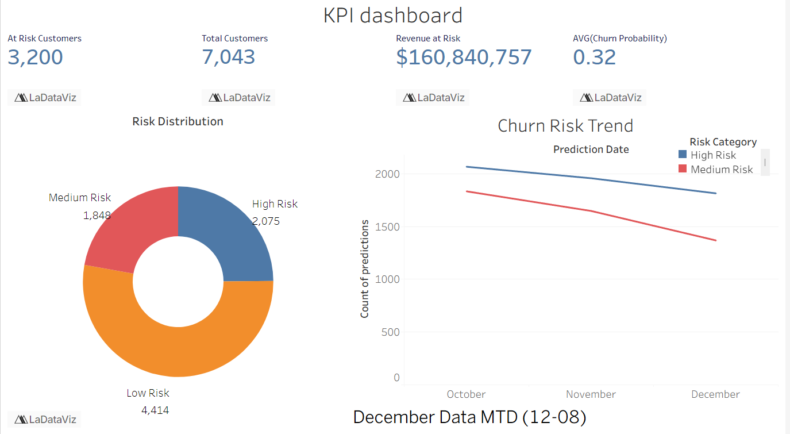

## 🚀 The Enterprise MLOps Workflow

This workflow uses a "Modern Data Stack" approach, separating data engineering from machine learning using open-source and free tools.

1.  **Data Source & Storage:** The **Telco Churn CSV** is stored locally in the `data/raw/` directory and loaded into **PostgreSQL**.
2.  **Orchestration:** **Airflow** (running in Docker) is the "brain" of the operation. It will run the entire pipeline on a schedule (e.g., daily).
3.  **Data Warehouse:** **PostgreSQL** (running in Docker) serves as both the Airflow metadata store and your data warehouse for churn analysis.
4.  **Ingestion:** The Airflow DAG loads the raw CSV into PostgreSQL in the `raw_data` schema.
5.  **Transformation:** The Airflow DAG triggers `dbt run`. **dbt Core** (free) connects to PostgreSQL. It reads from `raw_data`, cleans and stages the data (e.g., `stg_telco_churn`), and builds a final, feature-engineered table (e.g., `fct_customer_features`) in the `analytics` schema.
6.  **Training & Tracking (CI/CD):**
      * This is where **Azure Machine Learning (AzureML)** shines. Your Airflow DAG triggers an **AzureML Pipeline**.
      * This pipeline runs your `train.py` script as a job on Azure compute.
      * The script reads the `fct_customer_features` table directly from **PostgreSQL**.
      * It uses the integrated **MLflow** tracking *within AzureML* to log your models (XGBoost, RF, Logistic Regression) and their metrics (PR-AUC, Recall, etc.).
      * The best-performing model is "registered" in the AzureML Model Registry.
7.  **Batch Prediction:** After training, the pipeline uses the newly registered model to score all customers in your `fct_customer_features` table. The predictions (e.g., `customer_id`, `churn_probability`, `at_risk_flag`) are written back to a new table in **PostgreSQL** called `predictions`.
8.  **Real-Time Serving:** For the "production" part, you deploy the best model from the AzureML Registry as an **AzureML Managed Endpoint**. This creates a fully scalable, secure REST API (powered by FastAPI) that can score single customers in real-time.
9.  **Business Intelligence (BI) & Monitoring:**
      * **Power BI** or **Apache Superset** (free) connects *directly* to your **PostgreSQL** warehouse.
      * It reads from the `predictions` and `fct_customer_features` tables.
      * You build a dashboard to show business value: "Overall Churn Risk," "Key Churn Drivers," "Top 100 Customers to Target for Retention," and "Estimated Revenue at Risk."

### Free Tools Used:

  * **PostgreSQL:** 100% free and open-source database.
  * **Azure:** Use the "Free Tier" or "Azure for Students" account, which provides free credits. This will easily cover Blob Storage and the AzureML services for a project.
  * **Apache Superset/Power BI:** Free open-source BI tool or Power BI Desktop (free).
  * **Airflow, dbt, MLflow, FastAPI:** All 100% open-source and free.

-----

## 📊 Project Topic: Telco Customer Churn

  * **Business Problem:** A telecom company is losing customers to competitors. It's 5-10x more expensive to acquire a new customer than to retain an existing one.
  * **Business Value:** Proactively identify customers at high risk of churning. The retention team can then target this specific group with special offers, service upgrades, or support calls, reducing churn and saving millions in lost revenue.
  * **Metrics:** **Precision-Recall (PR-AUC)** (critical for imbalanced data), **Recall @ Top 10%** (how many *actual* churners did we find in the 10% of customers we predicted as highest risk?), **Revenue Saved**.
  * **Dataset:** [**Kaggle: Telco Customer Churn**](https://www.kaggle.com/datasets/blastchar/telco-customer-churn)
-----

## 📁 End-to-End Project Structure

This structure separates concerns (data, code, orchestration) and is set up for a professional CI/CD pipeline.

```
mlops-customer-churn/
│
├── .github/
│   └── workflows/
│       ├── test_dbt.yml          # Runs dbt tests on PR
│       └── test_python.yml       # Runs pytest for src/ code on PR
│       └── deploy_azure.yml      # On merge, triggers the AzureML pipeline
│
├── .gitignore
│
├── dbt_project/                  # Your dbt project (`dbt init dbt_project`)
│   ├── models/
│   │   ├── staging/
│   │   │   ├── stg_telco_churn.sql
│   │   │   └── stg_telco_churn.yml
│   │   └── marts/
│   │       ├── fct_customer_features.sql
│   │       └── schema.yml
│   ├── dbt_project.yml
│   └── profiles.yml             # Configured for Snowflake
│
├── data/
│   └── raw/
│       └── Telco-Customer-Churn.csv  # The source CSV you'll upload to Blob
│
├── orchestration/
│   ├── dags/
│   │   └── churn_pipeline_dag.py     # Airflow DAG
│   └── Dockerfile                # To run Airflow
│
├── src/                          # Main Python source code
│   ├── __init__.py
│   ├── train/                    # Model training logic
│   │   ├── train.py
│   │   └── model.py              # Defines models (XGBoost, RF)
│   ├── predict/                  # Real-time endpoint logic
│   │   ├── score.py              # The AzureML entry script
│   │   └── pydantic_models.py
│   └── tests/
│       ├── test_model.py
│       └── test_features.py
│
├── azureml/
│   ├── pipeline.yml              # AzureML Pipeline definition (YAML)
│   ├── environment.yml           # Conda environment for the AML compute
│   └── compute.yml               # Defines the compute cluster
│
├── docker-compose.yml            # Runs Airflow, Airbyte, Postgres (for Airflow)
│
└── README.md                     # Your project's new, polished README
```

## Dasboard Screenshots
